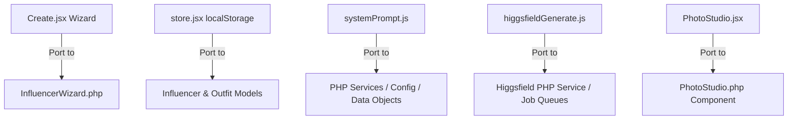

# Vividpersona: Project Blueprint & Reference Guide

This document maps the architectural design, feature set, and codebase details from the React+Vite **AI Influencer Studio (BLUEPRINT)** to the Laravel+Livewire **Vividpersona** application. It serves as a structural reference for future feature development and porting tasks.

---

## 1. Overview & System Comparison

Vividpersona is the server-persisted, team-enabled Laravel equivalent of the local-first React AI Influencer Studio.

| System Dimension | BLUEPRINT (React+Vite) | Vividpersona (Laravel+Livewire) |
| :--- | :--- | :--- |
| **Persistence** | Browser `localStorage` (per-user, local-first) | Relational Database (SQLite/MySQL/PostgreSQL) |
| **Identity & Access** | Local storage state (no authentication) | Laravel Auth (OTP login, signed invites, team pivot roles) |
| **UI Library** | Tailwind CSS + Custom CSS Variables | MaryUI (DaisyUI 5) + Tailwind CSS v4 |
| **Reactivity** | React States & Hooks | Livewire 4 Class-Based Components + Alpine.js |
| **API Proxy** | Vercel Serverless/Edge Functions | Laravel Controller / Livewire HTTP Client |
| **Generation Engine**| Higgsfield MCP (Direct & Proxied Fetch calls) | PHP HTTP (Guzzle/Pending Laravel HTTP Client wrappers) |

---

## 2. Core Feature Mapping

Below is the mapping of the frontend features implemented in the React blueprint to their corresponding Laravel/Livewire destinations.



### A. Influencer Creation Wizard
* **Blueprint Reference**: [`BLUEPRINT/src/pages/Create.jsx`](file:///w:/home/mgrunewalder/Projekte/PHP/Laravel/vividpersona/BLUEPRINT/src/pages/Create.jsx)
* **Vividpersona Target**: [`app/Livewire/InfluencerWizard.php`](file:///w:/home/mgrunewalder/Projekte/PHP/Laravel/vividpersona/app/Livewire/InfluencerWizard.php)
* **Design Details**:
  * Step-by-step definition: Gender selection, Niche selection, Personality Slider (Introvert vs. Extrovert), Physical Description Details (Ethnicity, Skin, Hair, Eyes, Build), Backstory input.
  * Backstory analysis: Runs backstory text through Claude API using backstory templates to extract structured physical descriptors, aesthetic vibes, and generate the character sheet prompt.
  * Image generation: Triggers Higgsfield to generate a Character Sheet and Close-ups, which serve as consistent reference images for future generations.

### B. Photo Studio & Outfit Library
* **Blueprint Reference**: [`BLUEPRINT/src/pages/PhotoStudio.jsx`](file:///w:/home/mgrunewalder/Projekte/PHP/Laravel/vividpersona/BLUEPRINT/src/pages/PhotoStudio.jsx) & [`BLUEPRINT/src/utils/photoStudioPrompt.js`](file:///w:/home/mgrunewalder/Projekte/PHP/Laravel/vividpersona/BLUEPRINT/src/utils/photoStudioPrompt.js)
* **Vividpersona Target**: A future `PhotoStudio.php` component and matching Blade views.
* **Design Details**:
  * Users mix and match wardrobes, hairstyles, custom background locations, time of day/lighting, and pose templates.
  * Constructs consistent, photorealistic prompts by injecting the influencer's physical descriptors (`@image3`/`@image4` face references) and wardrobe/outfit styling (`@image2` style reference) into the final generation prompt.

### C. Content & Video Studio
* **Blueprint Reference**: [`BLUEPRINT/src/pages/Influencers.jsx`](file:///w:/home/mgrunewalder/Projekte/PHP/Laravel/vividpersona/BLUEPRINT/src/pages/Influencers.jsx)
* **Vividpersona Target**: A future content-generation layout in the dashboard or team portal.
* **Design Details**:
  * **Content Studio**: Generates social media scripts, captions, and posts based on the influencer's backstory and niche content pillars.
  * **Video Studio**: Generates consistent 9:16 short-form video content from reference images using video-generation motion models (e.g. Higgsfield motion nodes).

---

## 3. Higgsfield MCP Integration (OAuth & Generation)

Higgsfield API communication uses the **Model Context Protocol (MCP)** endpoint structure.

### A. OAuth PKCE Flow
* **Blueprint Reference**: [`BLUEPRINT/src/utils/higgsfieldAuth.js`](file:///w:/home/mgrunewalder/Projekte/PHP/Laravel/vividpersona/BLUEPRINT/src/utils/higgsfieldAuth.js)
* **Protocol Detail**: Uses OAuth2 Authorization Code Flow with PKCE (Proof Key for Code Exchange) against `mcp.higgsfield.ai`.
* **Laravel Implementation**: Can be handled by adding a Higgsfield Socialite provider or a custom controller flow. Tokens (Access & Refresh tokens) should be stored in the `users` table or encrypted session.

### B. Image & Video Generation (MCP Call Protocol)
* **Blueprint Reference**: [`BLUEPRINT/src/utils/higgsfieldGenerate.js`](file:///w:/home/mgrunewalder/Projekte/PHP/Laravel/vividpersona/BLUEPRINT/src/utils/higgsfieldGenerate.js)
* **Endpoints**: 
  * POST `/api/hf/mcp` (proxied to `https://mcp.higgsfield.ai/mcp`)
* **Request Structure**:
  ```json
  {
    "jsonrpc": "2.0",
    "method": "generate",
    "params": {
      "prompt": "...",
      "model": "soul_2",
      "resolution": "576x1024",
      "reference_images": [
        { "role": "face", "image_url": "..." },
        { "role": "style", "image_url": "..." }
      ]
    },
    "id": 1
  }
  ```
* **Supported Models**:
  * `soul_2`: Premium photorealistic human generation. Struggles with detailed poses; needs simple spatial instructions.
  * `gpt_image_2`: High detail, works with complex pose setups.
  * `nano_banana_2` / `nano_banana_flash`: Superfast lightweight generation models.
  * `seedance_2_0`: Main motion/video generation model.

> [!IMPORTANT]
> **Stream Handling**: Higgsfield utilizes server-sent events (SSE) `text/event-stream` for generation progress and final URL dispatch. The Laravel implementation must handle SSE reading asynchronously (e.g., using a background runner or streaming Guzzle client) or poll status endpoints to prevent blocking PHP-FPM workers.

---

## 4. Key Libraries & Utilities in Blueprint

### A. System Prompt Library
* **File Path**: [`BLUEPRINT/src/utils/systemPrompt.js`](file:///w:/home/mgrunewalder/Projekte/PHP/Laravel/vividpersona/BLUEPRINT/src/utils/systemPrompt.js)
* **Components**:
  * **Lighting/Time Configs**: Warm golden hour, overcast daylight, blue-hour dusk, morning café light.
  * **Pose Library**: Simplified poses for `soul_2` (`POSES_SOUL`) vs. comprehensive directional poses (`POSES`).
  * **Wardrobe Library**: Categorized by gender, energy level (0–100), and style tags (bohemian, minimalist, dark & moody, preppy, sporty, old-money).
  * **Backstory Archetype Engine**: Automatically parses user inputs for matching niches/career roles (e.g. software engineer, yoga instructor) to prefill build hints, locked backgrounds, and style profiles.

### B. Photo Studio Prompts
* **File Path**: [`BLUEPRINT/src/utils/photoStudioPrompt.js`](file:///w:/home/mgrunewalder/Projekte/PHP/Laravel/vividpersona/BLUEPRINT/src/utils/photoStudioPrompt.js)
* **Components**:
  * Pre-built scene grids: City streets, modern office, coffee shops, home setups, and outdoor trails.
  * Pose matrices: Sitting, walking, leaning, drinking coffee, looking at phone.

---

## 5. Architectural Implementation Guidelines

When porting features from this blueprint into Vividpersona, respect the following constraints:

1. **Class-Based Livewire Components**: Every component must consist of a PHP class in `app/Livewire/` and a Blade file in `resources/views/livewire/`. Single-file Volt components are strictly forbidden.
2. **DaisyUI / MaryUI Components**: Utilize `<x-modal>`, `<x-input>`, `<x-button>`, `<x-select>` and `<x-file>` components to construct sleek, responsive, and state-of-the-art UI wrappers matching the React blueprint's aesthetics.
3. **Database Integrity**: Store influencer attributes inside the JSON-castable `InfluencerProperties` table to preserve field extensibility.
4. **Caching & Direct Uploads**: Mirror the blueprint's resource caching structure (avoiding re-uploading identical reference images to Higgsfield multiple times) to conserve credits and speed up rendering.
